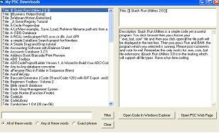



## MyPSCDownloads

### Description

Whenever I download something that interests me from PSC, I drop the unzipped folder into a folder called D:\MyPscDownloads (this can be changed in the code). This program enables me to easily view and search the titles and descriptions in what are often unintelligible folder names, link to the project and to the PSC web page. This is my first submission. Thanks to all those who submit to PSC and help beginners like me to learn. I hope I've given credit to everybody who's code I've used. Suggestions for improvement would be appreciated.
 
### More Info
 

             |
---                |---
**Submitted On**   |2006-07-21 16:57:16
**By**             |[Clive Astley](https://github.com/Planet-Source-Code/PSCIndex/blob/master/ByAuthor/clive-astley.md)
**Level**          |Beginner
**User Rating**    |5.0 (15 globes from 3 users)
**Compatibility**  |VB 6\.0
**Category**       |[Complete Applications](https://github.com/Planet-Source-Code/PSCIndex/blob/master/ByCategory/complete-applications__1-27.md)
**World**          |[Visual Basic](https://github.com/Planet-Source-Code/PSCIndex/blob/master/ByWorld/visual-basic.md)
**Archive File**   |[MyPSCDownl2013028132006\.zip](https://github.com/Planet-Source-Code/clive-astley-mypscdownloads__1-66263/archive/master.zip)

